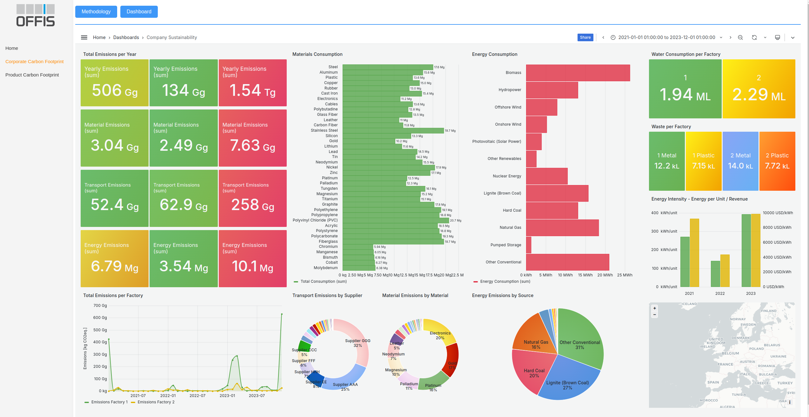

# Sustainability Reporting
Open-source solution designed to help companies comply with the Corporate Sustainability Reporting Directive (CSRD). It provides tools to collect, process, and visualize environmental data, including emissions, resource usage, and waste management, facilitating comprehensive sustainability reporting and performance analysis.

## Usage Guidelines

### Building the Project - Example Use Case
Make sure you have Docker installed

After cloning the repository, run on your terminal: 

`docker-compose up --build` 

If you are using a Windows machine, use:

`docker compose run angular npm i && docker compose up` 

This should build the images for the database, dashboard and website (platform). 

You can access the website at localhost port 4200.

It may not be necessary, but if you need to access the database and dashboard, the credentials are included in the docker-compose.yml.

### Building your own example

Before building and running, populate the tables in _./data_ and _./data2_ with your own data. 

Make sure not to alter the table structure. The application will create the database using your data

Run `docker-compose up --build`

The application will read the data from the database and create the respective dashboards and website.

Access them also at localhost port 4200.

